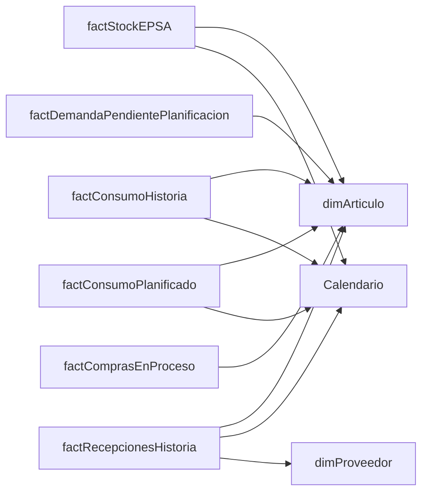

# EPSA Compras - Modelo de Datos

## Informacion General

| Propiedad | Valor |
|-----------|-------|
| Proyecto | EPSA-Compras.pbip (PBIR format) |
| Version | 2026.06 |
| Arquitectura | SSAS Tabular (Live Connection) + Power BI Report |
| SSAS Server | 192.168.2.47:2383 |
| SSAS Database | Compras_EPSA |
| Staging DB | staging_compras (192.168.2.47:1435) |
| Compatibilidad | 1600 (SQL Server 2025) |

## Arquitectura

```
Fuentes (192.168.2.7)
  ├── EPSA_BI (vistas BI)
  └── Nodum (ERP)
       │
       ▼
Staging Layer (192.168.2.47:1435 / staging_compras)
  ├── 8 tablas stg_* (SQL Agent daily refresh)
  │
       ▼
SSAS Tabular (192.168.2.47:2383 / Compras_EPSA)
  ├── 2 dimensiones + 6 hechos + Calendario
  ├── 25+ medidas DAX
  │
       ▼
Power BI Report (EPSA-Compras.pbip / Live Connection)
```

## Fuentes de Datos

| Servidor | Base de Datos | Uso |
|----------|---------------|-----|
| 192.168.2.7 | Nodum | ERP principal (consumos, proveedores, compras en proceso) |
| 192.168.2.7 | EPSA_BI | Data Warehouse / vistas BI (dimensiones, stock, consumo planificado, recepciones) |
| 192.168.2.47:1435 | staging_compras | Capa intermedia (tablas stg_* con refresh via SQL Agent) |
| 192.168.2.47:2383 | Compras_EPSA | SSAS Tabular (modelo semantico) |

## Tablas del Modelo (9)

### Dimensiones (2 + Calendario)

#### Calendario
- **Tipo:** Calculada (basada en CALENDARAUTO)
- **Descripcion:** Dimension de tiempo con ano fiscal (inicio en febrero)
- **Columnas:** Fecha, Ano Fiscal, Ano Fiscal Numero, Ano Mes, Ano Mes Numero, Fiscal Month, Fiscal Month in Quarter Number, Fiscal Month Number, Trimestre del ano fiscal, Trimestre del Ano Fiscal Numero, Trimestre Fiscal, Year Month Key
- **Jerarquias:**
  - **Fiscal Year-Quarter** (oculta): Año Fiscal → Trimestre del año fiscal → Año Mes
  - **Fiscal Year-Month** (oculta): Año Fiscal → Año Mes

#### DateAutoTemplate
- **Tipo:** Calculada (tabla de fechas automatica)
- **Columnas:** Date, Fiscal Month, Fiscal Month in Quarter Number, Fiscal Month Number, Fiscal Quarter, Fiscal Year, Fiscal Year Number, Fiscal Year Quarter, Fiscal Year Quarter Number, Year Month, Year Month Key, Year Month Number

#### dimArticulo
- **Fuente:** `Sql.Database("192.168.2.7", "EPSA_BI")` → `dbo.vw_Compras_DimArticuloEPSA`
- **Columnas clave:**
  - Articulo Codigo (PK, String)
  - Articulo Nombre (String)
  - Articulo Catalogo (String)
  - Articulo Stock Minimo (Double)
  - Clase Codigo / Clase Nombre (String)
  - Familia Codigo / Familia Nombre (String)
  - Subfamilia Codigo / SubFamilia Nombre (String)
  - Grupo Contable de Venta Codigo / Grupo Articulo Nombre (String)
  - Marca Codigo / Marca Descripcion (String)
  - Tipo Articulo Codigo / Tipo de Articulo Nombre (String)
  - Uso Codigo / Uso Nombre (String)
  - Unidad Stock (String)
  - Lote Minimo Compra (Double)
  - plazo (Int64)
  - Proveedor Articulo (String)
  - TipoComponente (String)

#### dimProveedor
- **Fuente:** `Sql.Database("192.168.2.7", "Nodum")` - Query SQL directo
- **Tablas origen ERP:** ct_proveedores, ct_paises, ct_provincias, ct_ciudades, ct_clasesprov, ct_fpagos
- **Filtro:** Proveedores con recepciones en historia (`epsa_bi.dbo.vw_ComprasBI_RecepcionesHistoria`)
- **Columnas clave:**
  - Proveedor Id (PK, String)
  - Proveedor Nombre (String)
  - Proveedor Direccion (String)
  - Proveedor Ciudad / Proveedor Ciudad Nombre (String)
  - Proveedor Departamento / Proveedor Nombre Departamento (String)
  - Pais Codigo / Pais Nombre (String)
  - Proveedor Telefono / Email (String)
  - Proveedor Origen (String)
  - Proveedor Clase Id / Proveedor Clase Nombre (String)
  - Proveedor Forma de Pago / Proveedor Forma de Pago Nombre (String)
  - Proveedor RUT (String)
  - Proveedor Status (String)

### Hechos

#### factStockEPSA
- **Fuente:** `Sql.Database("192.168.2.7", "EPSA_BI")` → `dbo.vw_ComprasBI_factStockEPSA`
- **Objetivo:** 1.4 Stock actual
- **Columnas:**
  - Stock Articulo Codigo (String)
  - Stock Cantidad (Double)
  - Stock Deposito (String)
  - Stock Estado (String) - existencia, stkaf
  - Stock Estado Tipo (String)
  - Stock Fecha_Corte (DateTime)

#### factConsumoHistoria
- **Fuente:** `Sql.Database("192.168.2.7", "Nodum")` - Query SQL directo
- **Tablas origen ERP:** cpf_stockaux, ct_articulos
- **Objetivo:** 1.1 Historia de consumos de EPSA
- **Filtros:** cod_emp = 'EPSA', cod_estado = 'existencia', fec_doc ultimos 5 anos, cod_tipoart NOT IN ('prvta', 'pt', 'semi', 'tubos')
- **Columnas:**
  - Consumo Articulo Codigo (String)
  - Consumo Cantidad (Double)
  - Consumo Deposito (String)
  - Consumo Documento (String)
  - Consumo Estado (String)
  - Consumo Fecha (DateTime)
  - Consumo Formulario (String)
  - Consumo N Documento (Int64)
  - Consumo Obligatorio (String)
  - Consumo Transaccion (Int64)

#### factConsumoPlanificado
- **Fuente:** `Sql.Database("192.168.2.7", "EPSA_BI")` → `dbo.vw_ComprasBI_factConsumoPlanificadoEPSA`
- **Objetivo:** 1.2 Trabajo planificado en EPSA que aun no ha sido programado
- **Columnas:**
  - Consumo Planificado Articulo (String)
  - Consumo Planificado Cantidad (Double)
  - Consumo Planificado Fecha Planificacion (DateTime)
  - Consumo Planificado N Paso Orden (Int64)
  - Consumo Planificado Orden (String)
  - Consumo Planificado Tipo Orden (String)

#### factDemandaPendientePlanificacion
- **Fuente:** `Sql.Database("192.168.2.7", "Nodum")` → `EPSA_BI.dbo.stg_RequerimientosSobreDemandaPendientePlanificacion`
- **Objetivo:** 1.3 Consumo requerido por pedidos pendientes (descomposicion de demanda)
- **Nota:** La tabla `00_Run_Staging` ejecuta el SP `dbo.Staging_RequerimientosSobreDemandaPendientePlanificacion` para poblar esta staging previo a la carga
- **Columnas clave:**
  - Demanda Pendiente Componente Codigo (String)
  - Demanda Pendiente Componente Cantidad Requerida (Double)
  - Demanda Pendiente Formula / Componente Formula (Int64)
  - Demanda Pendiente Componente Nivel (Int64)
  - Demanda Pendiente Componente Tipo / Tipo Ficha (String)
  - Producto / NomProducto (String)
  - Articulo Pedido x Cliente (String)
  - NodoID_Hex / NodoPadreID_Hex (String)
  - TrazaComposicion (String)
  - Obligatorio (String)
  - LoteMinFabricacion (Int64)

#### factRecepcionesHistoria
- **Fuente:** `staging_compras.dbo.stg_factRecepcionesHistoria` ← `EPSA_BI.dbo.vw_ComprasBI_HistoriaRecepciones`
- **Refresco:** INCREMENTAL (diario 08:30) / FULL (carga completa desde 2009)
- **Objetivo:** 1.5.2 Ordenes de compra - fecha de llegada / Historial de recepciones
- **Columnas clave:**
  - Empresa (String)
  - RecepcionFecha (DateTime)
  - RecepcionArticulo (String)
  - RecepcionCantidad (Double)
  - RecepcionOCDocumento / RecepcionOCNumero (String/Int)
  - RecepcionArticuloTipo (String)
  - OCProveedor / OCArticuloCodigo / OCDocumento / OCNumero (String/Int)
  - OCFecha / OCMoneda / OCPrecioMO / OCPrecioUSD / OCTotalMO / OCTotalTR
  - SolicitudDocumento / SolicitudNumero / SolicitudFecha
  - CompraDocumento / CompraNumero / CompraFecha / CompraOCDoc / CompraOCNumero

#### factComprasEnProceso
- **Fuente:** `Sql.Database("192.168.2.7", "Nodum")` - Query SQL directo (Union de 3 tablas)
- **Tablas origen ERP:** cps_solicitudes, cps_ocompras, cpf_stockaux + cpp_importacione
- **Objetivo:** 1.5.1 Solicitudes de compra + 1.5.2 Ordenes de compra + 1.5.3 Carpetas de importacion
- **Tipos incluidos:** 'Solicitud', 'Orden de Compra', 'Carpeta Import'
- **Filtros:** Ultimos 5 anos, tipo art no incluye PT, PRVTA, SEMI, TUBOS, SERVTA
- **Columnas:**
  - CompraEP Tipo (String)
  - CompraEP Proveedor (String)
  - CompraEP Doc / Serie / Numero (String/Int64)
  - CompraEP Articulo Codigo (String)
  - CompraEP Cantidad (Double)
  - CompraEP Fecha Ultima Modificacion (DateTime)
  - CompraEP Ultima Fecha Entrega (DateTime)

### Tablas de Medidas (Measure Groups)

#### Medidas_Consumo
| Medida | Expresion DAX |
|--------|---------------|
| Consumo Cantidad | `SUM(factConsumoHistoria[Consumo Cantidad])` |
| Consumo Cantidad Absoluta | `SUMX(factConsumoHistoria, ABS(...))` |
| Consumo Medio por Articulo | `DIVIDE([Consumo Cantidad], MovimientosArticulo)` |
| Consumo Mensual Promedio | `AVERAGEX(VALUES(Calendario[Fiscal Month]), ...)` |
| Consumo Promedio por Mes Activo | `DIVIDE([Sumatoria Movs Consumo Sin Recepciones], [Meses con Consumo])` |
| Consumos | `COUNTROWS(factConsumoHistoria)` |
| Meses con Consumo | Compleja - cuenta meses con consumo <> 0 |
| Promedio Anual Consumo | `AVERAGEX(VALUES(Calendario[Ano Fiscal]), ...)` |
| Promedio Consumo | `AVERAGE(factConsumoHistoria[Consumo Cantidad])` |
| Promedio Consumo por Movimiento | `DIVIDE(ABS([Sumatoria Movs...]), [Consumos])` |
| Sumatoria Movs Consumo Sin Recepciones | `ABS(CALCULATE(SUM(...), Documento <> "recstktr")) + 0` |
| _RangoFechas_Debug | Debug de rangos de fecha |

#### Medidas_Stock
| Medida | Expresion DAX |
|--------|---------------|
| Stock Existencia | `CALCULATE(SUM(factStockEPSA[Stock Cantidad]), Estado in {"existencia","stkaf"})` |
| Stock Compras | `SUM(factComprasEnProceso[CompraEP Cantidad])` |
| Stock MInimo | `SUM(dimArticulo[Articulo Stock Minimo])` |
| Stock Proyectado | `[Stock Existencia] + [Stock Compras]` |
| Gap Stock | `[Stock Existencia] - [Stock Minimo]` |
| Stock Debajo Minimo | `IF([Gap Stock] < 0, "CRITICO", "OK")` |
| E + C - CP - CD - SM | `Stock + Compras - ConsumoPlanificado - DemandaPendiente - StockMinimo` |

#### Medidas_Compras
| Medida | Expresion DAX |
|--------|---------------|
| Cantidad Recepciones | `COUNTROWS(factRecepcionesHistoria)` |
| Cobertura Meses sobre Existencia | `DIVIDE([Stock Existencia], [Consumo Promedio por Mes Activo])` |
| Lead Time Promedio Dias | Calculado desde RecepcionFecha - OCFecha |
| Ultima Recepcion Fecha | `MAX(factRecepcionesHistoria[RecepcionFecha])` |

#### Medidas_Consumo_Planificado
| Medida | Expresion DAX |
|--------|---------------|
| Consumo Planificado Cantidad | `SUMX(factConsumoPlanificado, ABS(...))` |

#### Medidas_DemandaPendiente
| Medida | Expresion DAX |
|--------|---------------|
| Cantidad Requerida por Demanda Pendiente | `SUMX(factDemandaPendientePlanificacion, ABS(...))` |

#### Medidas_HistoriaCompra
- Tabla vacia (reservada para futuras medidas)

## Relaciones (11)

| Desde | Columna | Hacia | Columna | Direccion |
|-------|---------|-------|---------|-----------|
| factConsumoHistoria | Consumo Fecha | Calendario | Fecha | OneDirection |
| factConsumoHistoria | Consumo Articulo Codigo | dimArticulo | Articulo Codigo | OneDirection |
| factStockEPSA | Stock Articulo Codigo | dimArticulo | Articulo Codigo | OneDirection |
| factConsumoPlanificado | Consumo Planificado Articulo | dimArticulo | Articulo Codigo | OneDirection |
| factDemandaPendientePlanificacion | Demanda Pendiente Componente Codigo | dimArticulo | Articulo Codigo | OneDirection |
| factStockEPSA | Stock Fecha_Corte | Calendario | Fecha | OneDirection |
| factConsumoPlanificado | Consumo Planificado Fecha Planificacion | Calendario | Fecha | OneDirection |
| factRecepcionesHistoria | RecepcionArticulo | dimArticulo | Articulo Codigo | OneDirection |
| factRecepcionesHistoria | RecepcionFecha | Calendario | Fecha | OneDirection |
| factRecepcionesHistoria | OC Proveedor | dimProveedor | Proveedor Id | OneDirection |
| factComprasEnProceso | CompraEP Articulo Codigo | dimArticulo | Articulo Codigo | OneDirection |

## Diagrama de Relaciones (Mermaid)



## Mapeo a Objetivos del Proyecto

| Objetivo | Tablas del modelo |
|----------|-------------------|
| 1.1 Historia de consumos | factConsumoHistoria + Medidas_Consumo |
| 1.2 Trabajo planificado no programado | factConsumoPlanificado + Medidas_Consumo_Planificado |
| 1.3 Consumo requerido por pedidos pendientes | factDemandaPendientePlanificacion + Medidas_DemandaPendiente |
| 1.4 Stock actual | factStockEPSA + Medidas_Stock |
| 1.4.1 Existencia | factStockEPSA[Stock Estado] in {"existencia","stkaf"} |
| 1.4.2 Existencia con vencimiento proximo | *Requiere verificar si existe columna de vencimiento* |
| 1.4.3 Cuarentena | *Requiere verificar campo Stock Estado Tipo* |
| 1.5 Compras en curso | factComprasEnProceso + factRecepcionesHistoria + Medidas_Compras |
| 1.5.1 Solicitudes de compra | factComprasEnProceso[CompraEP Tipo] = "Solicitud" |
| 1.5.2 Ordenes de compra | factComprasEnProceso[CompraEP Tipo] = "Orden de Compra" |
| 1.5.3 Carpetas de importacion | factComprasEnProceso[CompraEP Tipo] = "Carpeta Import" + factRecepcionesHistoria |

## Staging Layer (staging_compras)

| Tabla Staging | Fuente Original | Refresco | Filas aprox |
|---------------|-----------------|----------|-------------|
| stg_dimArticulo | EPSA_BI.dbo.vw_Compras_DimArticuloEPSA | FULL diario 08:00 | ~3,400 |
| stg_dimProveedor | Nodum.dbo.ct_proveedores (filtrado) | FULL diario 08:05 | ~450 |
| stg_factStockEPSA | EPSA_BI.dbo.vw_ComprasBI_factStockEPSA | FULL diario 08:10 | ~1,800 |
| stg_factConsumo | Nodum.dbo.cpf_stockaux | INCREMENTAL 08:20/16:00 | ~1,700,000 |
| stg_factRecepcionesHistoria | EPSA_BI.dbo.vw_ComprasBI_HistoriaRecepciones | INCREMENTAL diario 08:30 | ~50,000 |
| stg_factConsumoPlanificado | EPSA_BI.dbo.vw_ComprasBI_factConsumoPlanificadoEPSA | FULL diario 08:40 | ~1,400 |
| stg_factComprasEnProceso | Nodum (multi-tabla UNION) | FULL diario 08:50/16:10 | ~350 |
| stg_factDemandaPendiente | EPSA_BI.dbo.stg_RequerimientosSobreDemandaPendientePlanificacion | FULL diario 05:00 | ~37,000 |

**Linked Server:** `[192.168.2.7]` (SQL Agent service account tiene acceso)

**SQL Agent Jobs:** Corren 2 veces por d\u00eda (ma\u00f1ana y tarde) para tablas de alta volatilidad (ComprasEnProceso, Consumo)

## Workflow de Deploy a SSAS

### Archivos del modelo
| Archivo | Proposito |
|---------|----------|
| `model/database.json` | Export original desde Power BI (solo referencia, no modificar) |
| `model/database_staging.json` | Modelo deployable via TMSL (SIN relaciones a Calendario) |
| `model/database_staging_fixed.json` | Referencia completa (CON jerarquias + relaciones Calendario) |
| `scripts/deploy/add_calendario_metadata.ps1` | Script AMO post-deploy (inyecta jerarquias + relaciones) |

### Limitacion SSAS 2017 - Relaciones a Calendario
Las relaciones entre tablas de hechos y la tabla calculada `Calendario` **NO se pueden deployar via TMSL** (error: "invalid column ID"). Deben inyectarse post-deploy usando el script AMO:
```
scripts/deploy/add_calendario_metadata.ps1
```
Este script agrega:
- 2 jerarquias en Calendario (Fiscal Year-Quarter, Fiscal Year-Month)
- 4 relaciones: factConsumoHistoria, factStockEPSA, factConsumoPlanificado, factRecepcionesHistoria → Calendario[Fecha]

### Secuencia de deploy
1. Validar: `scripts/deploy/validate_model.ps1` (verifica tablas, jerarquias, relaciones y medidas criticas)
2. Deploy `database_staging.json` via TMSL (createOrReplace)
3. Ejecutar `add_calendario_metadata.ps1` (inyecta jerarquias + relaciones via AMO)
4. Process Full de todas las tablas
5. Verificar: `scripts/deploy/verify_model.ps1` (confirma estado final en servidor)

> **Nota:** `deploy_tmsl_remote.ps1` ejecuta la validacion automaticamente antes del deploy.

### Politica de proteccion del modelo
- **Nunca modificar `database.json`** (es el export original de Power BI, solo referencia)
- **`database_staging_fixed.json` es la baseline aprobada** - el deploy se valida contra este archivo
- **Validacion generica**: `validate_model.ps1` compara deploy vs baseline y detecta cualquier perdida estructructural (tablas, columnas, medidas, jerarquias, relaciones)
- **Regla de oro**: todo cambio estructural al modelo debe actualizarse en AMBOS archivos (`database_staging.json` y `database_staging_fixed.json`) y en `modelo_datos.md`
- **Unica diferencia esperada**: las relaciones a Calendario existen en baseline pero no en deploy (se inyectan via AMO post-deploy)
- El deploy se aborta automaticamente si se detectan elementos removidos no intencionales
